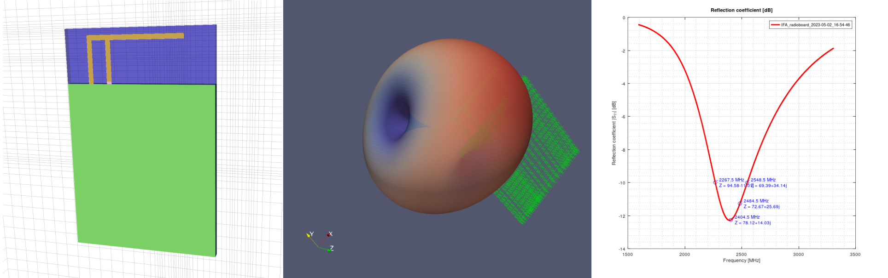

OpenEMS Antenna Simulation Workbench
====================================

*OpenEMS Antenna Simulation Workbench* is an antenna simulation focused extension developed by *Silicon Laboratories* for the free and open source EM solver - *OpenEMS*.

## Project goal

Simulation is usually an essential part of the of wireless hardware development. It enables the analysis and optimization of antennas without actually manufacturing and measuring them which ultimately results reduced expenses and time to market. Furthermore, an antenna which was already tuned using an EM simulator has in most cases superior initial performance and in some cases bench tuning can be completely eliminated.

The primary goal of this project is to help the development of wireless electronic devices by providing a free, open-source and easy-to-use tool for antenna simulations.

## Main features

* Script-based simulation description
* Simple configuration using a collection of variables and structures
* Automatic mesh generation based on material properties.
* Configurable mesh resolution at the edges to limit inaccuracy due to meshing
* Antenna port reflection (*S<sub>11</sub>*) calculation and plotting
* Antenna gain and efficiency calculation using *near-field to far-field* conversion
* 3D gain pattern export
* The executed script, the generated model and the post-processing results are automatically archived for each run (session)
* Support for including *.STL* model files (e.g. of an enclosure)
* Example projects
* Template file for custom projects

## Requirements & Dependencies

* Windows (x64)
* [Octave](https://www.gnu.org/software/octave/)
* [OpenEMS](https://openems.de/)
* [ParaView](https://www.paraview.org) (Optional)
* [STL read for Octave](https://github.com/bltsandwich1/STLread_for_Octave/) (Optional)

## Installation

1. Download and install Octave (https://www.gnu.org/software/octave/download#ms-windows)
2. Download and extract OpenEMS (https://openems.de/download/win64/openEMS_x64_v0.0.35-67-ga013077.zip)
3. Download (or clone) and extract this repository
4. (Optional) If you need advanced 3D visualizations (e.g. 3D gain patterns) download and install *ParaView* (https://www.paraview.org/download/, in most cases the standard (non-MPI) version is suitable)
5. (Optional) If you want to import STL models (e.g. of plastic enclosures) to the simulation then download and extract *STLread for Octave* (https://github.com/bltsandwich1/STLread_for_Octave/archive/master.zip)
6. Add the OpenEMS and workbench functions to Octave's path. To do this permanently, open `C:\Users\{username}\.octaverc` (create the file if needed) and add the following commands to the end of the file:
   ```Matlab
   addpath('{Full path to the matlab folder in the extracted OpenEMS folder}');
   addpath('{Full path to workbench_functions folder}');
   ```
   (If you want to use *STLread for Octave* too then add it's root folder to the path as well.)

     **Example:**
   ```Matlab
   addpath('C:\Octave\LIBS\openEMS\matlab');
   addpath('c:\Octave\OpenEMS-Antenna-Simulation-Workbench\workbench_functions');
   addpath('c:\Octave\LIBS\STLread_for_Octave-master');
   ```


7. Open Octave and in the command window type `pkg install -forge -verbose signal` to install the signal package from the web (It can take up to 15 minutes!)
8. Some issues in the past were resolved by running the `setup` command in Octave after installation. This is recommended to avoid unwanted errors with using compiled .oct functions.

## Usage

* [Example projects](examples)
* [How to create a custom PCB antenna simulation using the template](template)

## Disclaimer

Everything in this repository is provided AS IS. By downloading and using them, the user assumes and bears all liability emerging from the application of these examples.