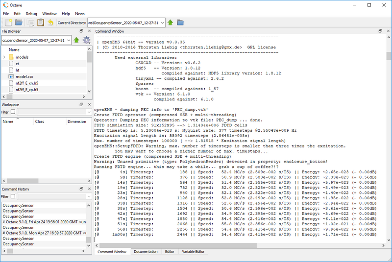
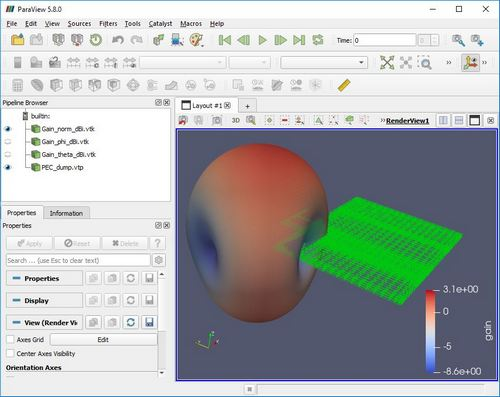

## Example Projects

There are multiple example projects demonstrating the usage of the antenna simulation workbench:

| Exampe name                  | Description   |
|------------------------------|---------------|
| **IFA_standalone**           | 2.4 GHz IFA antenna  on an 50 x 50 mm PCB  |
| **IFA_radioboard_with_wstk** | Silicon Laboratories Radio Board with 2.4 GHz IFA antenna and WSTK |
| **DualBand_IFA**             | Dual-band 2.4 GHz & 5.2 GHz IFA antenna |
| **OccupancSensor**           | Complete simulation of a 2.4 GHz device with meandered IFA antenna, batteries and plastic enclosure |
| **IFA_915M**                 | 915 MHz IFA antenna on a 25 x 25 mm PCB |

> **Tip:**  Start with *IFA_standalone* to cover the basics.

### Running the Examples

1. Make sure that all the required software components are installed (For the *OccupancySensor* example, STLread for Octave is also required.)

2. Open *GNU Octave (GUI)*

3. Click *File* → *Open* and open the *.m* script file of selected the example

4. Press `F5` or click on the run icon at the top of the *Editor* panel to run the simulation

5. Switch to the *Command Window* panel to see the command line output of the simulation

6. Once the model definition and mesh generation is finished, *AppCSXCAD* will automatically open where the generated model and mesh can be inspected. (This feature can be turned off by setting `showModel=0` in the *configuration section* of the simulation script.)
   
   
   
   > **Note:**  To cancel the simulation at this stage press **Ctrl+c** in Octave's Command Window before closing AppCSXCAD.

7. After closing *AppCSXCAD*, the FDTD solver will start.
   
   

8. Under normal circumstances the simulation will end when the total energy in the system decreases to -50 dB. The simulation is also aborted when the number of timesteps reaches a predefined threshold (100,000 by default).

9. After the simulation finishes, the reflection coefficient at the port (*S11*) is plotted and the input impedance is printed to the console.

10. After that, the near-field to far-field calculation begins. Once it's ready the radiated antenna parameters are printed to the console and the 3D gain pattern is saved.

11. To view the exported 3D gain patterns, locate the simulation session folder (at `sessions/PROJECTNAME_YYYY-MM-DD_HH_MM_SS`), open *ParaView* and load the generated *GainViewState.pvsm* state file (*File* →  *Load State*) from the `Gain_Pattern_2445MHz ` subfolder. (It is recommended to assign *.pvsm* files to *ParaView* in Windows.)
   
    

14. Also located in the session folder is the exported *.s1p* file as well as the generated plots in PDF format and the CSXCAD model file. The latter can be opened manually using *AppCSXCAD.exe* which is located in the root folder of OpenEMS.