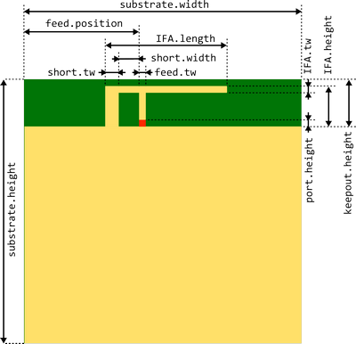

## How to create a custom PCB antenna simulation using the template

1.  Make sure that all the required software components are installed
    
2.  Make a copy of the  `AntennaSimulation_template.m`  template file and rename it.
    
3.  Open the file in  _GNU Octave (GUI)_
    
4.  In the  _Simulation Configuration_  section enable/disable certain processes and configure simulation settings:
    
    ```
    %%%%%%%%%%%%%%%%%%%%%%%%%%%%%%%%%%%%%%%%%%%%%%%%%%%%%%%%%%%%%%%%%%%%%%%%%%%%%%%%
    %%%%%%%%%%%%%%%%%%%%%   Application Specific Code Begin  %%%%%%%%%%%%%%%%%%%%%%%
    % Simulation Configuration
    % TODO: Configure simulation by modifying the listed variables

    % Generic settings
    runInitializations = 1;
    showModel          = 1;
    runSolver          = 1;
    calcPortReflection = 1;
    calcAntennaGain    = 1;

    saveSession = 1; % set to 1 to automatically save model and outputs

    unit = 1e-3; % all length in mm

    f0 = 2.45e9; % center frequency of simulation [Hz]
    BW = 1.5e9; % Simulation bandwidth [Hz]

    % Boundary condition (simulating open space propagation)
    usePML = 0; % set to 1 for more accurate absorbing boundary condition
                % (increases calculation time)

    % Mesh configuration
    %meshConfig.sizeAccuracy = 0.5; % Desired minimum accuracy of model sizes [unit*m] (default is 0.5)
    %meshConfig.meshRes = 1/20; % minimum mesh resolution compared to min wavelength (default is 1/20)

    % Post-processing config
    plotFreq = (f0-BW/2):1e6:(f0+BW/2); % Frequency values to plot e.g.: {f_start}:{f_step}:{f_stop}
    plotMarkers = [2405e6 2445e6 2485e6]; % Marker locations on plots

    gainCalcFreq = [2445e6]; % Frequency value(s) where the antenna gain will be calculated

    %%%%%%%%%%%%%%%%%%%%%   Application Specific Code End   %%%%%%%%%%%%%%%%%%%%%%%%
    %%%%%%%%%%%%%%%%%%%%%%%%%%%%%%%%%%%%%%%%%%%%%%%%%%%%%%%%%%%%%%%%%%%%%%%%%%%%%%%%

    ```
    
    -   Set the value of variables  `runInitialization`,  `showModel`,  `runSolver`,  `calcPortReflection`  and  `calcAntennaGain`  to  `1`/`0`  in order to enable/disable the corresponding processes.
        
        > **Tip:**  It is recommended to set runSolver, calcPortReflection and calcAntennaGain to 0 during model evaluation in order to disable simulation and post-processing tasks. Similarly, if for example only the post-processing section has to be re-executed, runInitialization, showModel and runSolver can be set to 0.
        
    -   Set  `saveSession = 1`  to in order to automatically archive the executed  _.m_  script file, the generated model and the post-processing results under the  `/sessions`  folder. (Otherwise all results will be saved to  `/tmp`  which gets overwritten each time the script runs.)
        
    -   Set the  `unit`  used for model definition (use  `unit = 1e-3`  for  _[mm]_).
        
    -   Use  `f0`  to set the center frequency of the simulation (in  _[Hz]_).
        
    -   Variable  `BW`  is used to configure the bandwidth of the simulation (i.e. by configuring the bandwidth of the Gaussian excitation signal).
        
        > **Note:**  `BW`  must be chosen so that  `0 < BW < 2*f0`  condition is met!
        
        > **Note:**  Using a small bandwidth does not necessary mean faster simulation as the simulation is using time-domain solver and a narrow-band excitation signal is long in time-domain. In fact,  **for a typical PCB antenna simulation  `BW=0.5*f0 ... 0.9*f0`  results the shortest simulation time**. One possible reason for using shorter bandwidth is if there are unwanted resonances in the system, which can significantly increase simulation time. Use the command line output of  _OpenEMS_  to identify such scenarios. If the decrease of total energy in the system is very slow after the excitation has ended, there is probably a resonant structure in the model, which restrains the EM energy from leaving the system.
        
    -   Set  `usePML = 0`  for the default (_MUR_) boundary condition. Setting  `usePML = 1`  forces the usage of a more accurate boundary condition (_PML_) which requires significantly more time to calculate.
        
    -   Modify the  `meshConfig`  structure to override default mesh generation settings. Define`meshConfig.sizeAccuracy`  to overwrite the default maximum absolute size errors (in [mm], if  `unit = 1e-3`  was configured) resulting from meshing. Define  `meshConfig.meshRes`  to set minimum mesh resolution relative to wavelength in homogeneous regions. The effect of material properties (i.e. εr  > 1) is automatically compensated.
        
        > **Note:**  Decreasing  `meshConfig.sizeAccuracy`  can significantly increase simulation time!
        
    -   The  `plotFreq`  array contains the frequency points (in [Hz]), where the port reflection values will be evaluated and plotted. Use the built-in  `{f_start}:{f_step}:{f_stop}`  syntax to create a linearly spaced range (e.g.  `2.4e9 : 1e6 : 2.5e9`  ).
        
    -   Add frequency values (in [Hz]) to the  `plotMarker`  array where a marker should be added on plots.
        
    -   Add frequency values (in [Hz]) to the  `gainCalcFreq`  array where the antenna gain should be evaluated.
        
5.  **Select the core parameters**  which are suitable to describe the model and define them at beginning of the  _Model Definition_  section. (It is highly recommended to do this step and to avoid using raw coordinates in the later steps in order to make overview and possible future changes easier.)
    
    > **Tip:**  Draw a sketch of the model and mark the defined parameters.
    
    _Example_:
    
    

    ```
    substrate.width = 50;       % Width of substrate
    substrate.height = 50;      % Height of substrate
    substrate.thickness = 1.5;  % Thickness of substrate

    keepout.height = 8;         % Height of antenna keepout area

    ifa.length = 24.7;          % Total length of IFA antenna
    ifa.height = 7.5;           % Total height of IFA antenna
    ifa.tw = 1;                 % Width of main (horizontal) IFA trace

    short.tw = 3;               % Trace width of (vertical) short circuit stub
    short.width = 4.5;          % Inner width of inductive short circuit loop

    feed.position = 20;         % Distance of feed from the (left) edge of dielectric
    feed.tw = 1;                % Trace width of feed element

    port.height = 0.5;          % Height of simulation lumped port
    ```
    
    > **Note:**  Don't forget to include a port to the model where the excitation can be applied and antenna reflection can be evaluated.
    
6.  **Define substrate and port parameters:**
    
    _Example for defining substrate and port parameters:_
    
    ```
    port.R = 50;        % Resistance of feeding port [Ohm]
    substrate.epsR = 4.4;         % Relative permittivity (dielectric constant) of substrate
    substrate.lossTangent = 0.02;   % Loss tangent of substrate
    substrate.kappa = substrate.lossTangent * 2*pi*f0 * EPS0 * substrate.epsR; % Calculate kappa based on loss tangent at center frequency
    ```
    
7.  **Create the simulation model:**  The simulation model is stored in the  `CSX`  object, which must be provided as the first parameter to every function which manipulates the model and it must be overwritten with the updated version returned by these functions (e.g.:  `CSX = AddBox(CSX, ...)`.
    
    1.  **Define the required properties (e.g.:  _metal_,  _material_)**  before adding actual components to the model. In most cases, only metal and material properties are needed. Each property must be identified by a unique name (e.g.:  _`substrate`_).
        
        -   _**Metal properties**_  are defined as perfect electric conductors (_PEC_) by default, and in most cases it is not required to model the thickness and actual conductivity of the metal to get accurate results.
            
            _Example for creating a  _metal_  property:_
            
            ```
            CSX = AddMetal( CSX, 'groundplane'); % Create a metal property called 'groundplane');
            ```
            
        -   _**Material properties**_  are defined as vacuum by default. In order to configure other materials (like dielectrics), use the  `SetMaterialProperty`  function.
            
            _Example for creating a  _material_  property:_
            
            ```
            CSX = AddMaterial( CSX, 'substrate'); % Create a material property called 'substrate');
            CSX = SetMaterialProperty( CSX, 'substrate', 'Epsilon',substrate.epsR, 'Kappa', substrate.kappa);
            ```
            
        
        > **Tip:**  Use properties to differentiate model component groups (even if they use the same underlying property) as there is a feature in the 3D viewer (_AppCSXCAD_) to hide specific properties. For example, add a separate metal property for the ground planes of the PCB and a separate metal for the traces of the IFA antenna.
        
    2.  **Add primitives**  (boxes, cylinders, etc.) to the model. Primitives are defined using their definitive dimensions and absolute 3D coordinates (represented as 3 element length vectors in Octave). The syntax of adding primitives is  `Add...(CSX, property_name , priority, parameter_1, parameter_2, ...)`  where  `property_name`  is the name of the assigned property. The  `priority`  parameter determines the priority of the primitive in case there is an overlap of different properties (higher value means higher priority).
        
        The most commonly used primitive is the  _**box**_  which can be added using the  `AddBox`  function. To define the bounds of the box, pass the two absolute coordinates of its two opposite corners. Note that by simply using e.g. the same z coordinates, it is possible to add 2D boxes (rectangles) and it is actually the preferred way of defining metal traces.
        
        _In the following example a PCB substrate box is created. One of the box's corner is at the  _Origin_  (x=0, y=0, z=0) while the other one is calculated using predefined dimension parameters (the negative signs are used because of the opposing direction of y and z axes):_
        
        ```
        p1  = [0, 0, 0];
        p2  = [substrate.width, -substrate.height, -substrate.thickness];
        CSX = AddBox( CSX, 'substrate', 1, p1, p2);
        ```
        
        > **Tip:**  To create a PCB, define the substrate as a (3D)  _material box_  and place the (2D) metal traces on the surface of the substrate using a higher priority. If there is an area where the top and bottom layer of the PCB are mostly filled with ground pours and the number and position of ground stitching vias are adequate (see section 2 of AN928: EFR32 Layout Design Guide for guidelines), then this area can be modeled with a single, solid metal box to simplify model creation and accelerate calculation.
        
        > **Note:**  For more information about the supported primitives and the concept of priority refer to  [http://openems.de/index.php/Primitives.html](http://openems.de/index.php/Primitives.html)
        
    3.  **Add excitation port:**  In order to apply the excitation signal and evaluate the antenna reflection, a port must be added as well. In most cases a simple  _lumped port_  is adequate. The syntax of calling this function is:  `[CSX, port] = AddLumpedPort(CSX, priority, portId, resistance, p1, p2, direction, isActive)`  where:
        
        -   `portId`  is an identification number used when more ports are defined (should be 1 if there is only 1 port),
        -   `resistance`  is the source resistance (usually 50 [Ohm]),
        -   `p1`  &  `p2`  are the two opposing corners of the port's boundary the box
        -   `direction`  is a 3D unity vector describing the (positive) direction for the excitation (e.g. [0, 1, 0] for +y direction excitation)
        -   `isActive`  is used to select the active port when more than port is defined (should be true in this case).
        
        _Example for adding a lumped excitation port:_
        
        ```
        [CSX, port] = AddLumpedPort(CSX, 4 , 1, port.R, p1, p2, [0 1 0], true);
        ```
        
        > **Note:**  Add...Port functions return the newly created port structure as well which must be stored as well (i.e. by calling these functions like [CSX, port] = Add...Port(... ).
        
        > **Note:**  For more information on the different supported port types refer to  [https://openems.de/index.php/Ports.html](https://openems.de/index.php/Ports.html)
        
    4.  (Optional)  **Define antenna center**  (radiation source). For more accurate gain calculation, it is required to define the center point of the radiation source i.e. by assigning the  `antennaCenter`  variable. The central point of the antenna is usually a suitable choice.
        
        _Example for defining the antenna center location:_
        
        ```
        antennaCenter = antenna.position + [antenna.width/2, antenna.width/2, 0];
        ```
        
8.  **Run the simulation**  and refine the model if needed.
    
    > **Tip:**  To verify that the mesh is dense enough to give accurate results, try increasing the target mesh density by decreasing  `meshConfig.sizeAccuracy`  and  `meshConfig.meshRes`. If the results with the new mesh are close to the ones got with the original mesh, then the original mesh density was probably already adequate.